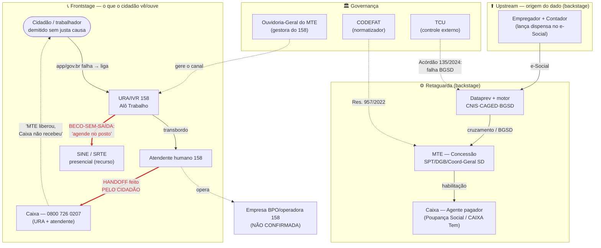

# Mapa de Atores — Atendimento ao Seguro-Desemprego pelo Canal Telefônico (URA 158 ↔ 0800 Caixa)

> Artefato da Parte C do Exercício 2.1. Destila a pesquisa adversária (v3) em um
> mapa **decidido** via sessão `/grill-me` (ver `C_grill_transcript.md`). Segue as
> boas práticas da Aula 02 (Passo 0 → Passo 5).

---

## Passo 0 — Propósito do mapa

**Endereçar a demanda falha (*failure demand*) do canal telefônico do
Seguro-Desemprego**, originada na **bipartição** do atendimento entre dois donos
do canal — o **MTE / Central 158** (concessão) e a **Caixa / 0800 726 0207**
(pagamento) — cujo *handoff* é feito **pelo próprio cidadão**, sem transferência
automática nem prontuário compartilhado.

O mapa não é um inventário institucional do SD (financiamento FAT, BNDES e repasse
constitucional ficaram **fora de escopo** por decisão de altitude). Ele é
telefônico-cêntrico: detalha quem participa do atendimento por telefone e a
retaguarda que **gera o motivo de ligar**.

---

## Passo 4 — Mapa de relações (jornada + handoffs + fluxo de dados)

Três camadas: (1) o fluxo da ligação; (2) os **handoffs críticos** — o
158→Caixa em **vermelho** (feito pelo cidadão) e o URA→SINE como beco-sem-saída;
(3) o **fluxo de dados a montante** que gera a notificação imprópria. Governança
(normatização / controle) entra como setas **tracejadas**.

> **Leitura do diagrama.** A ligação só existe porque um dado a montante
> (empregador → e-Social → Dataprev/BGSD → MTE) gerou uma notificação/indeferimento
> que o cidadão não entende. Ele liga para o 158, é empurrado para o presencial
> (beco-sem-saída) **ou** para o 0800 da Caixa — e o *handoff* MTE→Caixa é ele
> mesmo quem faz. Nenhum ator é **Aprovador (A) único** atravessando a fronteira
> 158↔Caixa: é a violação de **agnosticismo organizacional** que materializa a
> demanda falha.

---

## Tabela de atores (RACI por etapa + categoria × palco)

Etapas da jornada: **E1** Origem do dado (e-Social) · **E2** Tentativa digital →
falha · **E3** Ligação/URA 158 · **E4** Atendimento humano 158 · **E5** Handoff →
Caixa 0800 · **E6** Pagamento/contestação · **E7** Recurso presencial (SINE/SRTE).

RACI: **R** = executa · **A** = responde/aprova · **C** = consultado · **I** = informado.

| # | Ator | Categoria | Palco | Etapa(s) RACI | Entra na jornada | Sai da jornada | Poder | Interesse |
|---|------|-----------|-------|---------------|------------------|----------------|-------|-----------|
| 1 | **Cidadão / trabalhador demitido** | Usuário direto | front | E2:R · E3:R · E5:**R** · E6:C | E1 (é demitido) | Resolução, desistência ou judicialização | Baixo | Alto |
| 2 | **URA/IVR 158** | Sistema | front | E3:R · E4:C | E3 (liga) | Transbordo ou abandono | Baixo (delegado) | — (sem agência) |
| 3 | **Atendente humano 158** | Operador | front | E4:R · E5:C | E4 (transbordo) | Encaminha ou orienta | Baixo | Alto |
| 4 | **Empresa BPO/operadora do 158** *(NÃO CONFIRMADA)* | Fornecedor | back | E3:A · E4:A | E3 (opera o canal) | — | **NÃO ESTIMADO** (opacidade é o achado) | Alto (se remunerada por volume) |
| 5 | **Ouvidoria-Geral do MTE** | Gestor do canal | governança | E3:A · E4:A | Permanente | — | Médio | Alto |
| 6 | **MTE — concessão (SPT/DGB/Coord-Geral SD)** | Gestor/decisor | back | E1:C · E5:**A** · E6:C | E1 (recebe BGSD) | Habilita ou indefere | Alto | Alto |
| 7 | **Dataprev + motor CNIS·CAGED·BGSD** | Fornecedor + Sistema | back | E1:R · E5:C | E1 (cruzamento) | Entrega BGSD | Alto | Alto |
| 8 | **Caixa — 0800 / agente pagador** | Operador | front+back | E5:R · E6:**R/A** | E5 (handoff) | Paga ou bloqueia | Alto | Médio |
| 9 | **CODEFAT** | Normatizador | governança | E1–E7:C (normatiza) | Permanente | — | Alto | Alto |
| 10 | **Empregador + contador (e-Social)** | Intermediário / origem | back (upstream) | E1:**R** | E1 (lança dispensa) | Dado entra no BGSD | Baixo (contador) | Médio |
| 11 | **SINE / SRTE presencial** | Operador | fronteira (saída) | E7:R · E4:C | E7 (recurso) | Resolve recurso ou nova fila | Médio (capilaridade) | Alto |
| 12 | **TCU** | Controle externo | governança | E1:C · E6:C (audita) | Episódico (auditoria) | — | Alto | Alto |

> **Achado RACI.** A coluna **A** está fragmentada na fronteira E5: o MTE é "A" da
> concessão, a Caixa é "A" do pagamento, e **ninguém** é "A" da experiência
> ponta-a-ponta. O cidadão é o único "R" do handoff (E5) — exatamente a demanda
> falha que o mapa pretende endereçar.

---

## Passo 5 — Atores-chave e hipóteses de diagnóstico

Atores-chave (poder de bloquear ou viabilizar a mudança): **MTE-concessão (6),
Caixa (8), Ouvidoria-MTE (5), Dataprev/BGSD (7), CODEFAT (9), BPO 158 (4), TCU (12)**
e o **Cidadão (1)** como voz coletiva (via centrais sindicais).

**H1 (central) — A bipartição 158↔0800 institucionaliza demanda falha estrutural.**
Atores que sustentam o status quo: MTE (controla a política), Caixa (remuneração
pelo papel de pagador), CODEFAT (nunca normatizou a unificação do canal).
*Evidência:* reclamações sistemáticas "MTE liberou, Caixa não recebeu"; ausência de
ANS público de propagação MTE→Caixa; handoff E5 sem "A" único (ver tabela RACI).

**H2 — A opacidade do contrato da URA 158 é fator de risco e incentivo perverso.**
PNCP, Compras.gov.br, DOU e Portal da Transparência não localizaram contrato
vigente identificável da operação humana do 158 (só STFC e TI/Algar TI, que não
cobrem a operação). Se o BPO (4) é remunerado por volume, não há incentivo a
resolver no 1º contato (FCR).

**H3 — A relação MTE-Dataprev é o ponto único de falha que materializa a demanda
no telefone.** TCU Acórdão 135/2024 imputa ~R$ 1,9 bi / 300 mil+ inconsistências à
governança contratual MTE-Dataprev. A notificação imprópria gerada a montante (E1)
é o que faz o cidadão ligar (E3).

**H6 — A digitalização (>75% dos requerimentos em 2023, sobre ~7,16 mi de
trabalhadores) empurrou o telefone para "última instância"** — atendendo
justamente quem tem menos letramento digital. Conecta com os princípios #9
(utilizável por todos) e #14 (fácil obter ajuda humana) de Lou Downe.

> **Fora de escopo (telefônico-cêntrico):** H4 (judicialização via Res. 957/2022 +
> STJ Tema 1.136 + TNU Tema 356) e H5 (capacidade sindical sobre a URA) são
> diagnósticos válidos do v3, mas puxam para atores rebaixados neste recorte.

---

## Vozes Críticas

- **TCU** *(já no roster, ator 12)* — a voz crítica mais consistente: Acórdão
  135/2024-Plenário (inconsistências e ~R$ 1,9 bi em indícios) e auditoria do
  eSocial (abertura do DataLake).
- **Reclame Aqui** — padrão persistente 2017–2024 contra "Ministério do Trabalho"
  e "Caixa": 158 não atende, "todos os atendentes ocupados", "aguardando
  confirmação do posto", crédito bloqueado no CAIXA Tem.
- **Ipea — TD 3059 (Amorim, 2024)** — perfil e padrões de acesso repetido ao SD;
  Jornal da USP (Menezes, 2024) sobre queda histórica da cobertura.
- **LACUNA DE CONTROLE SOCIAL DIGITAL (achado).** Não se localizou trabalho
  específico de Transparência Brasil, Open Knowledge Brasil, Artigo 19 ou Fiquem
  Sabendo sobre a Central 158/URA do SD. **A ausência é, ela mesma, um achado** —
  reforça H2 (opacidade): o canal nomeado no título do serviço não tem fiscalização
  da sociedade civil organizada.

---

## Decisões do grill citadas neste mapa

1. **Sistemas automatizados são atores** (URA/IVR 158 e motor BGSD/Dataprev) — não
   foram dobrados dentro de operadores humanos, por serem onde mora o
   beco-sem-saída (URA) e a causa-raiz da notificação (BGSD). *(grill Q3)*
2. **Eixo categoria × palco** (frontstage / backstage / governança) — adotado para
   separar quem o cidadão vê de quem age nos bastidores, revelando que a falha
   nasce no backstage (E1) e estoura no frontstage (E3–E5). *(grill Q4)*
3. **Inclusão upstream do empregador/contador (e-Social)** como ator de origem —
   para tornar visível que a ligação é consequência de um dado a montante, não uma
   demanda espontânea do cidadão. *(grill Q6)*

---

*Mapa derivado de `B_relatorio_assistente_v3.md` (pesquisa adversária, 3 rodadas de
auditoria) e decidido na sessão `/grill-me` registrada em `C_grill_transcript.md`.*
